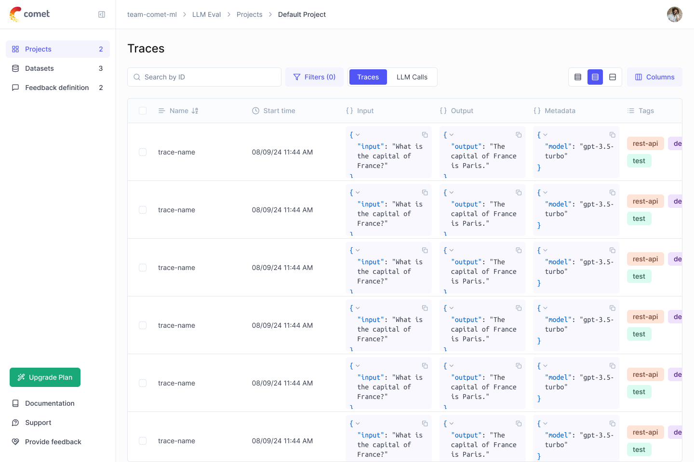

<h1 align="center" style="border-bottom: none">
    <div>
        <a href="https://www.comet.com/site/products/opik?utm_source=opik&utm_medium=github&utm_content=website_button">
            
            <br>
            Opik
        </a>
    </div>
    Open-source end-to-end LLM Development Platform<br>
</h1>

<p align="center">
Confidently evaluate, test and monitor LLM applications. 
</p>

<div align="center">

[](https://pypi.org/project/opik/)
[](https://github.com/comet-ml/opik/blob/main/LICENSE)
[](https://github.com/comet-ml/opik/actions/workflows/build_apps.yml)
<a target="_blank" href="https://colab.research.google.com/github/comet-ml/opik/blob/master/apps/opik-documentation/documentation/docs/cookbook/opik_quickstart.ipynb">
  <!--  -->
</a>

</div>

<p align="center">
    <a href="http://www.comet.com/site/products/opik"><b>Website</b></a> •
    <a href="https://chat.comet.com"><b>Slack community</b></a> •
    <a href="https://x.com/Cometml"><b>Twitter</b></a> •
    <a href="https://www.comet.com/docs/opik/"><b>Documentation</b></a>
</p>



## 🚀 What is Opik?

Opik is an open-source platform for evaluating, testing and monitoring LLM applications. Built by [Comet](https://www.comet.com?utm_source=opik&utm_medium=github&utm_content=what_is_opik_link).

<br>

You can use Opik for:
* **Development:**
  * **Tracing:** Track all LLM calls and traces during development and production ([Quickstart](https://www.comet.com/docs/opik/quickstart/?utm_source=opik&utm_medium=github&utm_content=quickstart_link), [Integrations](https://www.comet.com/docs/opik/integrations/overview/?utm_source=opik&utm_medium=github&utm_content=integrations_link)
  * **Annotations:** Annotate your LLM calls by logging feedback scores using the [Python SDK](https://www.comet.com/docs/opik/tracing/annotate_traces/#annotating-traces-and-spans-using-the-sdk?utm_source=opik&utm_medium=github&utm_content=sdk_link) or the [UI](https://www.comet.com/docs/opik/tracing/annotate_traces/#annotating-traces-through-the-ui?utm_source=opik&utm_medium=github&utm_content=ui_link). 

* **Evaluation**: Automate the evaluation process of your LLM application:

    * **Datasets and Experiments**: Store test cases and run experiments ([Datasets](https://www.comet.com/docs/opik/evaluation/manage_datasets/?utm_source=opik&utm_medium=github&utm_content=datasets_link), [Evaluate your LLM Application](https://www.comet.com/docs/opik/evaluation/evaluate_your_llm/?utm_source=opik&utm_medium=github&utm_content=eval_link))

    * **LLM as a judge metrics**: Use Opik's LLM as a judge metric for complex issues like [hallucination detection](https://www.comet.com/docs/opik/evaluation/metrics/hallucination/?utm_source=opik&utm_medium=github&utm_content=hallucination_link), [moderation](https://www.comet.com/docs/opik/evaluation/metrics/moderation/?utm_source=opik&utm_medium=github&utm_content=moderation_link) and RAG evaluation ([Answer Relevance](https://www.comet.com/docs/opik/evaluation/metrics/answer_relevance/?utm_source=opik&utm_medium=github&utm_content=alex_link), [Context Precision](https://www.comet.com/docs/opik/evaluation/metrics/context_precision/?utm_source=opik&utm_medium=github&utm_content=context_link)

    * **CI/CD integration**: Run evaluations as part of your CI/CD pipeline using our [PyTest integration](https://www.comet.com/docs/opik/testing/pytest_integration/?utm_source=opik&utm_medium=github&utm_content=pytest_link)

* **Production Monitoring**: Monitor your LLM application in production and easily close the feedback loop by adding error traces to your evaluation datasets.

<br>

## 🛠️ Installation

The easiest way to get started with Opik is by creating a free Comet account at [comet.com](https://www.comet.com/signup?from=llm?utm_source=opik&utm_medium=github&utm_content=install).


If you'd like to self-host Opik, you create a simple local version of Opik using::

```bash
pip install opik-installer

opik-server install
```

For more information about the different deployment options, please see our deployment guides:

| Installation methods | Docs link |
| ------------------- | --------- |
| Local instance | [](https://www.comet.com/docs/opik/self-host/self_hosting_opik/#all-in-one-installation?utm_source=opik&utm_medium=github&utm_content=self_host_link)
| Kubernetes | [](https://www.comet.com/docs/opik/self-host/self_hosting_opik/#kubernetes-installation?utm_source=opik&utm_medium=github&utm_content=kubernetes_link)


## 🏁 Get Started

If you are logging traces to the Cloud Opik platform, you will need to get your API key from the user menu and set it as the `OPIK_API_KEY` environment variable:

```bash
export OPIK_API_KEY=<Your API key>
export OPIK_WORKSPACE=<You workspace, often the same as your username>
```

If you are using a local Opik instance, you don't need to set the `OPIK_API_KEY` or `OPIK_WORKSPACE` environment variable and isntead set the environment variable `OPIK_BASE_URL` to point to your local Opik instance:

```bash
export OPIK_BASE_URL=http://localhost:5173
```

You are now ready to start logging traces using the [Python SDK](https://www.comet.com/docs/opik/python-sdk-reference/?utm_source=opik&utm_medium=github&utm_content=sdk_link2).

### 📝 Logging Traces

The easiest way to get started is to use one of our integrations. Opik supports:

| Integration | Description | Documentation | Try in Colab |
| ----------- | ----------- | ------------- | ------------ |
| OpenAI | Log traces for all OpenAI LLM calls | [Documentation](https://www.comet.com//docs/opik/tracing/integrations/openai/?utm_source=opik&utm_medium=github&utm_content=openai_link) | [](https://colab.research.google.com/github/comet-ml/opik/blob/master/apps/opik-documentation/documentation/docs/cookbook/openai.ipynb) |
| LangChain | Log traces for all LangChain LLM calls | [Documentation](https://www.comet.com/docs/opik/tracing/integrations/langchain/?utm_source=opik&utm_medium=github&utm_content=langchain_link) | [](https://colab.research.google.com/github/comet-ml/opik/blob/master/apps/opik-documentation/documentation/docs/cookbook/langchain.ipynb) |
| LlamaIndex | Log traces for all LlamaIndex LLM calls | [Documentation](https://www.comet.com/docs/opik/tracing/integrations/llama_index?utm_source=opik&utm_medium=github&utm_content=llama_index_link) | [](https://colab.research.google.com/github/comet-ml/opik/blob/master/apps/opik-documentation/documentation/docs/cookbook/llama-index.ipynb) |

> [!TIP]  
> If the framework you are using is not listed above, feel free to [open an issue](https://github.com/comet-ml/opik/issues) or submit a PR with the integration.

If you are not using any of the frameworks above, you can also using the `track` function decorator to [log traces](https://www.comet.com/docs/opik/tracing/log_traces/?utm_source=opik&utm_medium=github&utm_content=traces_link):

```python
from opik import track

@track
def my_llm_function(user_question: str) -> str:
    # Your LLM code here

    return "Hello"
```

> [!TIP]  
> The track decorator can be used in conjunction with any of our integrations and can also be used to track nested function calls.

### 🧑‍⚖️ LLM as a Judge metrics

The Python Opik SDK includes a number of LLM as a judge metrics to help you evaluate your LLM application. Learn more about it in the [metrics documentation](https://www.comet.com/docs/opik/evaluation/metrics/overview/?utm_source=opik&utm_medium=github&utm_content=metrics_2_link).

To use them, simply import the relevant metric and use the `score` function:

```python
from opik.evaluation.metrics import Hallucination

metric = Hallucination()
score = metric.score(
    input="What is the capital of France?",
    output="Paris",
    context=["France is a country in Europe."]
)
print(score)
```

Opik also includes a number of pre-built heuristic metrics as well as the ability to create your own. Learn more about it in the [metrics documentation](https://www.comet.com/docs/opik/evaluation/metrics/overview?utm_source=opik&utm_medium=github&utm_content=metrics_3_link).

### 🔍 Evaluating your LLM Application

Opik allows you to evaluate your LLM application during development through [Datasets](https://www.comet.com/docs/opik/evaluation/manage_datasets/?utm_source=opik&utm_medium=github&utm_content=datasets_2_link) and [Experiments](https://www.comet.com/docs/opik/evaluation/evaluate_your_llm/?utm_source=opik&utm_medium=github&utm_content=experiments_link).

You can also run evaluations as part of your CI/CD pipeline using our [PyTest integration](https://www.comet.com/docs/opik/testing/pytest_integration/?utm_source=opik&utm_medium=github&utm_content=pytest_2_link).

## 🤝 Contributing

There are many ways to contribute to Opik:

* Submit [bug reports](https://github.com/comet-ml/opik/issues) and [feature requests](https://github.com/comet-ml/opik/issues)
* Review the documentation and submit [Pull Requests](https://github.com/comet-ml/opik/pulls) to improve it
* Speaking or writing about Opik and [letting us know](https://chat.comet.com)
* Upvoting [popular feature requests](https://github.com/comet-ml/opik/issues?q=is%3Aissue+is%3Aopen+label%3A%22enhancement%22) to show your support

To learn more about how to contribute to Opik, please see our [contributing guidelines](CONTRIBUTING.md).
